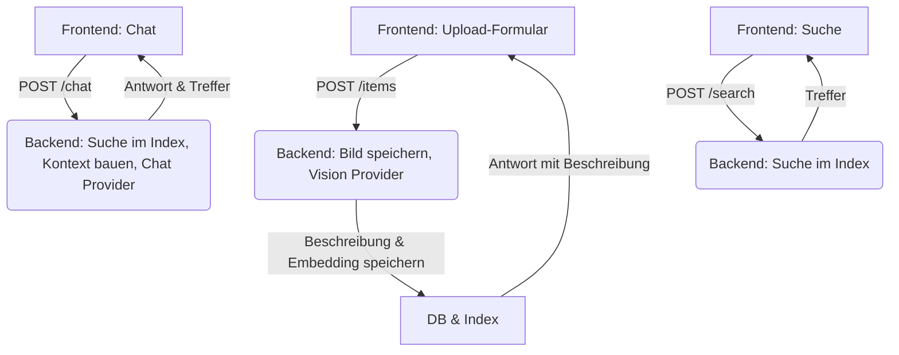

# Architektur Fundgrube

## Überblick

Fundgrube ist ein modulares Lost-and-Found System mit automatischer Bildbeschreibung und semantischer Suche per Chat (RAG).

---

## Komponenten

- **Frontend:** React + Vite, Upload- und Chat-UI, mobilfähig
- **Backend:** FastAPI REST API, SQLite DB, Vision/Chat-Provider, Embedding, RAG-Logik
- **Uploads:** Speicherung im Backend (`backend/uploads/`)
- **Datenbank:** SQLite, Tabelle `items` (`backend/app/db/database.py`)
- **RAG:** Embedding-Provider (modular, ENV-Variable `EMBEDDING_PROVIDER`), Index, semantische Suche

---

## Provider-System

- **Vision Provider:** Erzeugt Bildbeschreibungen (dummy, ollama, api/OpenAI)
- **Chat Provider:** Generiert Antworten im Chat (dummy, ollama, api/OpenAI)
- **Embedding Provider (RAG):** Erzeugt Text-Embeddings für die semantische Suche (dummy, local/sentence-transformers, weitere Provider möglich)
- **Provider-Auswahl:**
	- Über ENV-Variablen: `VISION_PROVIDER`, `CHAT_PROVIDER`, `EMBEDDING_PROVIDER`
	- EMBEDDING_PROVIDER=local für lokale Embeddings (sentence-transformers, Modell all-MiniLM-L6-v2)
	- API-Key für OpenAI: `OPENAI_API_KEY`
	- Ollama-Host: `OLLAMA_HOST` (optional)
- **Factory-Pattern:** Zentrale Auswahl/Instanziierung in `backend/app/llm/factory.py` (Vision/Chat) und `backend/app/rag/index.py` (Embedding)
- **Erweiterbar:** Neue Provider können einfach ergänzt werden (siehe jeweilige Factory und Provider-BaseClass, für Embeddings siehe `index.py`)

---

## Datenfluss & Ablauf (RAG mit Embeddings)

---

## ENV-Variablen (Backend)

| Variable           | Beschreibung                                 | Beispielwert           |
|--------------------|----------------------------------------------|------------------------|
| VISION_PROVIDER    | Provider für Bildbeschreibung                | dummy / ollama / api   |
| CHAT_PROVIDER      | Provider für Chat                            | dummy / ollama / api   |
| EMBEDDING_PROVIDER | Provider für Text-Embeddings (RAG)           | dummy / local / ollama / api / openai |
| OPENAI_API_KEY     | API-Key für OpenAI (nur bei Provider=api)    | sk-...                 |
| OLLAMA_HOST        | Host für Ollama-Server (optional)            | http://localhost:11434 |

---

## Response-Formate Provider

- **Vision:** `{ "description": "...", "model": "...", "latency_ms": ... }`
- **Chat:** `{ "answer": "...", "model": "...", "latency_ms": ... }`

---

## Hinweise & Erweiterung

- Die Architektur ist modular, Provider können einfach ergänzt werden.
- Dummy-Provider erzeugen Testdaten (keine Kosten).
- Uploads und Datenbank bleiben nach Neustart erhalten.
- Für API-Details siehe [api.md](api.md)